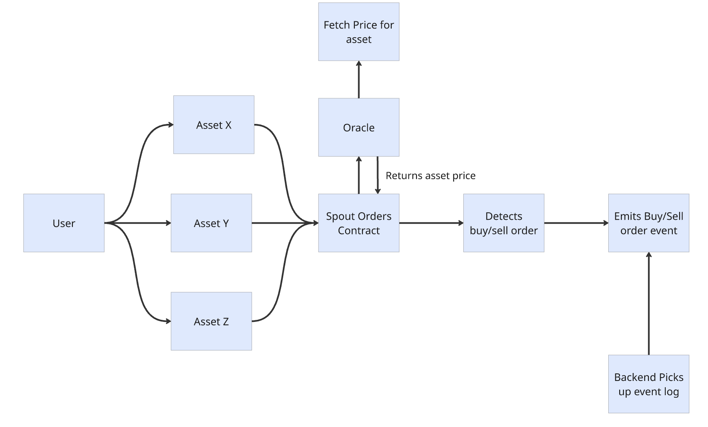
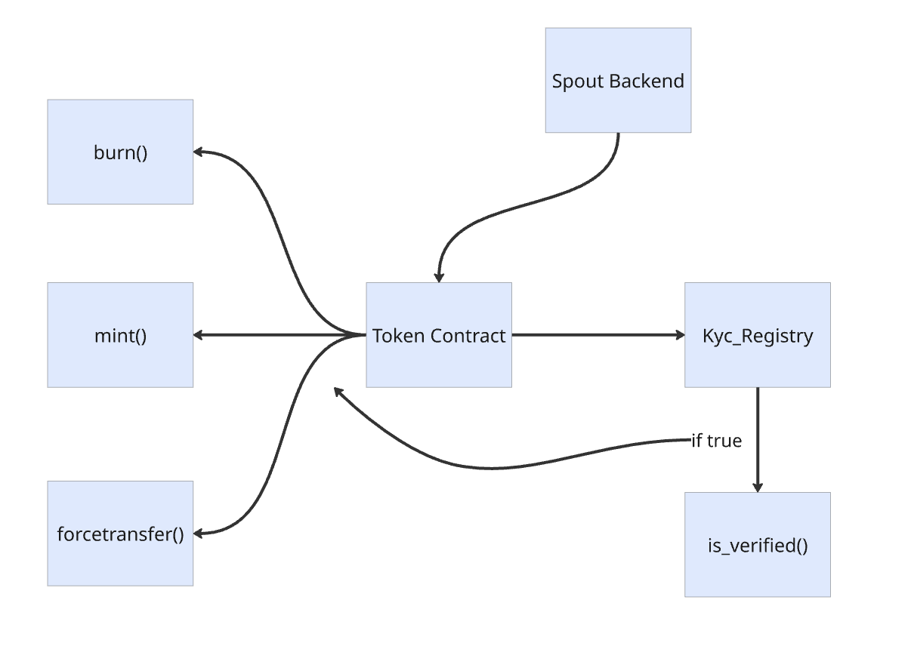

# 🚀 Spout Finance - The Future of Decentralized Investing

> *Bringing traditional finance to DeFi through tokenized real-world assets on Aptos blockchain*

## 🌐 **Live Deployments**
### 🚀 [**Launch Spout Finance →**](https://spout-aptos.vercel.app/)
### 🛡️ **TEE Backend**: [https://92a7be451ddb4f83627f81b188f8137bba80a65d-8090.dstack-prod5.phala.network/](https://92a7be451ddb4f83627f81b188f8137bba80a65d-8090.dstack-prod5.phala.network/)
### 🔗 **Smart Contracts**: [View on Aptos Testnet Explorer](https://explorer.aptoslabs.com/object/0x27220ac73da9851e597d9a016baa842b7c33b064f322da7ca24230ad5e606554?network=testnet)


[](https://aptos.dev/)
[](https://move-language.github.io/move/)
[](https://nextjs.org/)
[](https://phala.network/)

## 🌟 What is Spout Finance?

**Spout Finance** is a revolutionary DeFi platform that bridges traditional investment assets with blockchain technology. Built on the lightning-fast **Aptos blockchain**, we tokenize investment-grade U.S. bonds and equities, making them accessible as secure, yield-bearing tokens backed 1:1 by real ETFs.

### 💡 The Vision
Transform how people invest by making high-quality traditional assets accessible, transparent, and efficient through blockchain technology - without sacrificing security or compliance.

---

## ✨ Why Choose Spout Finance?

### 🏛️ **Real Asset Backing**
- **1:1 ETF Backing**: Every token is fully backed by real-world assets
- **Investment Grade**: Only high-quality bonds and blue-chip equities
- **Transparent Reserves**: On-chain proof of backing with real-time verification
- **Regulated Assets**: Compliant with traditional finance standards

### ⚡ **Aptos Blockchain Advantage**
- **Sub-Second Finality**: Near-instant transaction confirmation
- **Ultra-Low Fees**: Cost-effective trading for all portfolio sizes
- **Move Smart Contracts**: Memory-safe, formally verified contract execution
- **Scalable Infrastructure**: Handle thousands of transactions per second

### 🔐 **Enterprise-Grade Security**
- **Multi-Oracle Price Feeds**: Switchboard and Pyth integration for accurate pricing
- **On-Chain KYC**: Decentralized identity verification system
- **TEE Backend**: Secure backend deployment on Phala's Trusted Execution Environment
- **Formal Verification**: Move language ensures mathematical proof of contract safety

### 🎯 **Professional Trading Experience**
- **Real-Time Charts**: TradingView-style interface with live market data
- **Advanced Analytics**: Portfolio tracking with risk metrics and performance analysis
- **Institutional Features**: Order management, automated rebalancing, and yield optimization
- **Multi-Asset Support**: Bonds (LQD), equities (TSLA, AAPL), and commodities (GOLD)

---

## 🏗️ Platform Architecture

Spout Finance consists of three integrated components working together to deliver a seamless DeFi experience:

### 📊 **System Flow Architecture**


*Trading flow showing user interactions with assets, oracle price feeds, and order execution*


*Backend integration architecture showing token contracts, KYC registry, and system interactions*

### 🖥️ **Frontend Application** (`app-interface/`)
**Next.js 15 + TypeScript** - Modern, responsive web application
- **Wallet Integration**: Native Aptos wallet support (Petra, Martian, etc.)
- **Trading Interface**: Professional-grade trading with real-time charts
- **Portfolio Management**: Comprehensive analytics and performance tracking
- **KYC Flow**: Streamlined identity verification process

### 🔗 **Smart Contracts** (`Movecontracts/`)
**Move Language** - Secure, efficient blockchain infrastructure
- **Token Standards**: Fungible Asset (FA) implementation for all synthetic assets
- **Trading Engine**: Automated order matching and execution
- **Oracle System**: Multi-source price feeds for accurate asset pricing
- **Compliance Layer**: Built-in KYC registry and regulatory compliance

### 🛡️ **Backend Services** (`spout-backend-aptos/`)
**NestJS + TEE** - Scalable, secure backend infrastructure
- **Event Processing**: Real-time blockchain event monitoring and processing
- **Price Feeds**: Integration with Alpha Vantage, Pyth, and Switchboard oracles
- **Database Management**: Supabase integration for persistent data storage
- **API Services**: RESTful APIs for market data, user management, and analytics

---

## 🚀 Supported Assets

| Asset | Type | Ticker | Description | Backing |
|-------|------|--------|-------------|---------|
| 🏛️ **Investment Grade Bonds** | Fixed Income | LQD | iShares iBoxx $ Investment Grade Corporate Bond ETF | 1:1 ETF |
| 🚗 **Tesla** | Equity | TSLA | Tesla Inc. Stock Token | 1:1 ETF |
| 🍎 **Apple** | Equity | AAPL | Apple Inc. Stock Token | 1:1 ETF |
| 🥇 **Gold** | Commodity | GOLD | SPDR Gold Shares ETF Token | 1:1 ETF |

---

## 🎯 Key Features

### 📊 **Advanced Trading**
- **Real-Time Execution**: Sub-second order processing on Aptos blockchain
- **Professional Charts**: Interactive price charts with technical analysis tools
- **Order Types**: Market orders, limit orders, and advanced order management
- **Portfolio Analytics**: Real-time P&L tracking, yield calculations, and risk metrics

### 🔍 **Transparency & Trust**
- **Proof of Reserves**: Verifiable 1:1 backing of all tokenized assets
- **Open Source**: Fully auditable smart contracts and backend services
- **Real-Time Data**: Live price feeds from multiple professional data sources
- **Compliance**: Built-in regulatory compliance and audit trails

### 🌐 **Multi-Oracle Price Feeds**
- **Switchboard**: Decentralized oracle network integration
- **Pyth Network**: High-frequency financial market data
- **Alpha Vantage**: Professional-grade stock market APIs
- **Custom Aggregation**: Multi-source price validation and aggregation

---

## 🚀 Quick Start

### 1️⃣ **Access the Platform**
Visit our live deployment: [Spout Finance Platform](https://your-platform-url.com)

### 2️⃣ **Connect Your Wallet**
- Install an Aptos wallet (Petra, Martian, or compatible)
- Connect to the platform with one click
- Ensure you're on Aptos Testnet/Mainnet

### 3️⃣ **Complete KYC Verification**
- Complete our streamlined on-chain KYC process
- Verification is handled securely through smart contracts
- Gain access to all trading features upon approval

### 4️⃣ **Start Trading**
- Fund your account with USDC
- Browse available tokenized assets
- Execute trades with professional-grade tools
- Track your portfolio performance in real-time

---

## 🛠️ Development Setup

### Prerequisites
- **Node.js 18+** and npm
- **Aptos CLI** for smart contract development
- **Docker** (optional, for containerized deployment)

### Quick Setup
```bash
# Clone the repository
git clone https://github.com/AptosHackathon/spout-finance.git
cd spout-finance

# Install frontend dependencies
cd app-interface && npm install

# Install backend dependencies  
cd ../spout-backend-aptos && npm install

# Compile smart contracts
cd ../Movecontracts/contract && aptos move compile
```

### Run Development Environment
```bash
# Start frontend (port 3000)
cd app-interface && npm run dev

# Start backend (port 8090)
cd spout-backend-aptos && npm run start:dev

# Deploy contracts to testnet
cd Movecontracts/contract && aptos move publish --profile testnet
```

---

## 🌐 Live Deployments

### 🌍 **Production Platform**
- **Frontend**: [Spout Finance App](https://your-platform-url.com)
- **TEE Backend**: [Phala Network Deployment](https://92a7be451ddb4f83627f81b188f8137bba80a65d-8090.dstack-prod5.phala.network/)

### ⛓️ **Blockchain Addresses**
- **Main Contract**: `0xf21ca0578f286a0ce5e9f43eab0387a9b7ee1b9ffd1f4634a772d415561fa0fd`
- **Wormhole Bridge**: `0x5bc11445584a763c1fa7ed39081f1b920954da14e04b32440cba863d03e19625`
- **Pyth Oracle**: `0x7e783b349d3e89cf5931af376ebeadbfab855b3fa239b7ada8f5a92fbea6b387`

---

## 🛡️ Security & Compliance

### 🔐 **Security Measures**
- **Move Language**: Memory-safe smart contracts with formal verification
- **Multi-Signature**: Enhanced security for administrative functions
- **TEE Deployment**: Backend services run in Trusted Execution Environment
- **Regular Audits**: Continuous security assessment and improvement

### 📋 **Regulatory Compliance**
- **KYC/AML**: On-chain identity verification and compliance tracking
- **Audit Trail**: Complete transaction history and regulatory reporting
- **Risk Management**: Built-in risk assessment and monitoring tools
- **Data Privacy**: GDPR-compliant user data handling

---

## 🎯 Roadmap

### 🚀 **Phase 1: Foundation** ✅
- ✅ Core smart contracts deployment
- ✅ Multi-asset trading platform  
- ✅ KYC registry implementation
- ✅ TEE backend deployment

### 📈 **Phase 2: Growth** 🔄
- 🔄 Additional asset classes (REITs, International ETFs)
- 🔄 Advanced trading features (derivatives, lending)
- 🔄 Mobile application development
- 🔄 Institutional API access

### 🌍 **Phase 3: Scale** 📅
- 📅 Cross-chain integration (Ethereum, Solana)
- 📅 Automated portfolio management
- 📅 Institutional partnerships
- 📅 Global regulatory compliance

---

## 🤝 Contributing

We welcome contributions from the community! Whether you're interested in:

- **Frontend Development** - React, TypeScript, UI/UX improvements
- **Smart Contract Development** - Move language, blockchain logic
- **Backend Services** - NestJS, API development, data processing
- **Documentation** - Guides, tutorials, API documentation

### Get Started
1. Fork the repository
2. Create a feature branch: `git checkout -b feature/amazing-feature`
3. Make your changes and add tests
4. Submit a pull request with a clear description

---

## 📞 Support & Community

### 🆘 **Get Help**
- 📧 **Email**: support@spout-finance.com
- 💬 **Discord**: [Join our community](https://discord.gg/spout-finance)
- 🐦 **Twitter**: [@SpoutFinance](https://twitter.com/SpoutFinance)
- 📚 **Documentation**: [docs.spout-finance.com](https://docs.spout-finance.com)

### 📖 **Resources**
- 🎓 [Getting Started Guide](./docs/getting-started.md)
- 🔧 [Developer Documentation](./docs/developers.md)
- 📊 [API Reference](./docs/api-reference.md)
- 🔐 [Security Best Practices](./docs/security.md)

---

## 📄 License

This project is licensed under the **MIT License** - see the [LICENSE](LICENSE) file for details.

---

<div align="center">

### 🌟 Built with ❤️ by the Spout Finance Team

**Making traditional finance accessible through blockchain innovation**


</div>